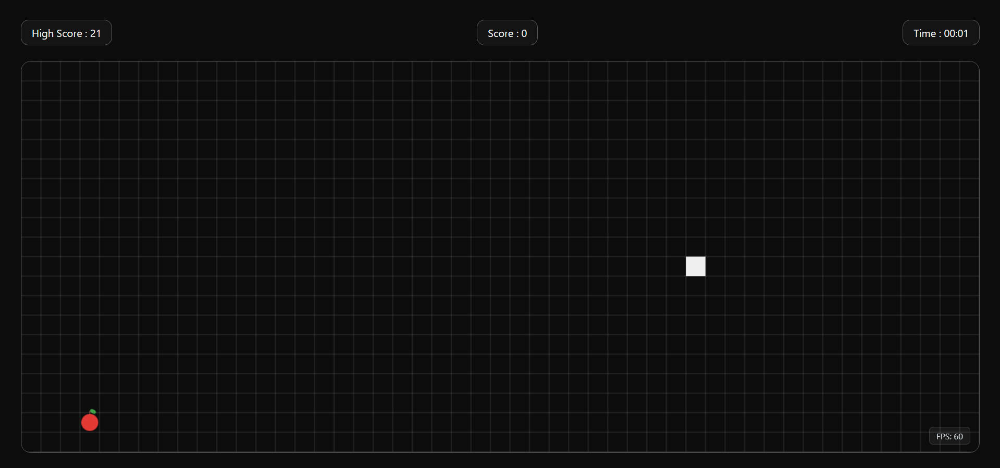

# 🐍 Snake Game

  
  
  
  

A modern, browser-based **Snake Game** built using pure web technologies.  
Features smooth gameplay, FPS monitoring, keyboard controls (Arrow keys + WASD), and an animated game-over popup.

---

## 📝 Description

This Snake Game is a canvas-based arcade game developed using **HTML, CSS, and JavaScript**.  
It focuses on smooth and playable mechanics, performance awareness through a real-time FPS counter, and a responsive layout that adapts to different screen sizes.

Players control the snake to collect apples, increase their score, and avoid collisions with walls or the snake’s own body.  
When the game ends, a popup displays the final score, high score, and time played, with an option to retry.

---

## 🛠 Tech Stack

| Technology | Description |
|----------|-------------|
| 🟧 **HTML5** | Structure and Canvas rendering |
| 🟦 **CSS3** | Styling, layout, and animations |
| 🟨 **JavaScript (ES6)** | Game logic, controls, and performance |
| 🎨 **Canvas API** | Drawing grid, snake, and apple |
| 💾 **LocalStorage** | High score persistence |

---

## 🌐 Live Demo

**Publish URL:** 
https://utkarshkashid.github.io/Snake-Game/

---

## 🎮 Features

🎯 Smooth and playable snake movement  
⌨️ Controls using **Arrow keys + WASD**  
🍎 Apple-based scoring system  
📈 Real-time FPS counter (drops when snake turns)  
⏱ Game timer (stops on game over)  
🪟 Animated Game Over popup with retry button  
💾 High score saved using LocalStorage  
📱 Responsive game board  

---

## 📸 Screenshots

### 🔹 Initial Screen

### 🔹 Generated QR Code

---

## 👨‍💻 Author

**Utkarsh Kashid**  
Feel free to fork, modify, and enhance this project.
If you like this project, don’t forget to star the repository!✨
